<h1 align="center">Hey 👋 I'm Sheriff</h1>

  Software architect, just building stuff I find interesting.

  

---

###  What I'm building

- 🛰️ **Earth-Observation & Intelligence systems** — Exploring Large Spatial Foundation models, geospatial AI, satellite/AOI monitoring, real-time map UIs at scale
- 📈 **Quant on the side** — algo research, financial markets HFTS and local hedge-fund automation rigs

<em>Iguess the ADHD is doing its thing here, turns out a hundred things can all be interesting at once.</em>

---

###  Stats

  

  

  

---

###  Stack I reach for

  

  
  

---

###  GitHub Contributions Breakout

<picture>
  <source media="(prefers-color-scheme: dark)" srcset="https://raw.githubusercontent.com/Sheriffelrefaey/Sheriffelrefaey/github-breakout/images/breakout-dark.svg" />
  <source media="(prefers-color-scheme: light)" srcset="https://raw.githubusercontent.com/Sheriffelrefaey/Sheriffelrefaey/github-breakout/images/breakout-light.svg" />
  
</picture>

<em>Regenerated daily from my contribution graph.</em>

